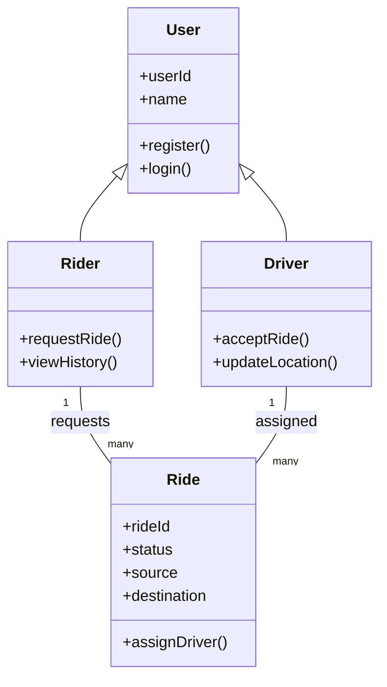
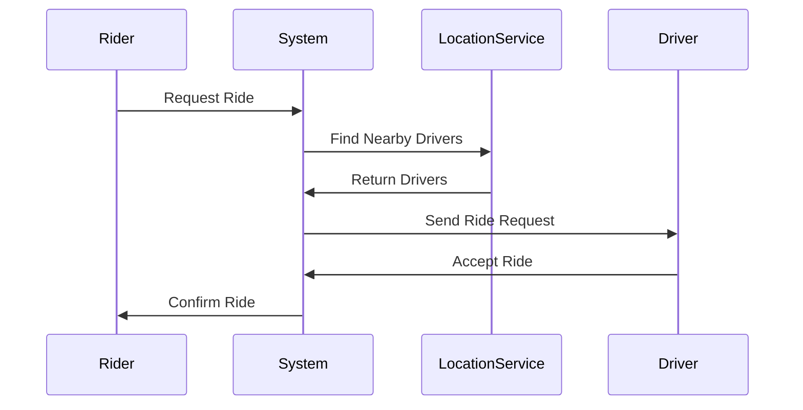

# Low Level Design (LLD) of OLA/UBER

## Overview
This document outlines the low-level design for a ride-hailing service similar to OLA/UBER.

## Core Components

## Problem Statement

We want to build a cab booking platform that allows a rider to book a cab.

## Details

- **Location Representation:** Each location is defined by x, y coordinates.
- **Distance Calculation:** The distance between two points (x1, y1) and (x2, y2) is calculated as `sqrt((x1 - x2)^2 + (y1 - y2)^2)`.
- **Cab Assignment:** Each cab has only one driver.
- **No Cab Sharing:** Sharing of cabs between riders is not allowed.
- **Cab Type:** Only a single type of cab is available.

## Functional Requirements

- **Register Rider**
- **Register Driver**
- **Book a Cab:** Rider selects a location and attempts to book a cab.
- **Driver Matching Strategy:** Implement a strategy to match drivers with riders.
- **Pricing Strategy:** Implement a strategy to calculate trip pricing.
- **Trip Details:** Each trip includes Rider, Driver, Source, Destination, PricingStrategy, and DriverMatchingStrategy.
- **Payment:** Riders pay the trip amount.
- **Payment Modes:** Support multiple payment methods.

### 1. User Module
- **Rider**
    - Register/Login
    - Request Ride
    - View Ride History
- **Driver**
    - Register/Login
    - Accept/Reject Ride
    - Update Location

### 2. Ride Module
- **Ride Request**
    - Source & Destination
    - Rider Details
    - Ride Status (Requested, Accepted, In Progress, Completed, Cancelled)
- **Ride Matching**
    - Find nearest available driver
    - Assign ride

### 3. Location Module
- **Track Driver Location**
- **Calculate ETA & Distance**

### 4. Payment Module
- **Fare Calculation**
- **Payment Processing**
- **Invoice Generation**

### 5. Notification Module
- **Ride Updates**
- **Driver Arrival Alerts**

## Class Diagram (Sample)

## Sequence Diagram (Ride Request Flow)

## Database Tables (Sample)

- **Users**: user_id, name, type (rider/driver), contact
- **Rides**: ride_id, rider_id, driver_id, source, destination, status, fare
- **Locations**: user_id, latitude, longitude, timestamp
- **Payments**: payment_id, ride_id, amount, status

---

## Extensibility
- Add features like ratings, surge pricing, pooling, etc.
