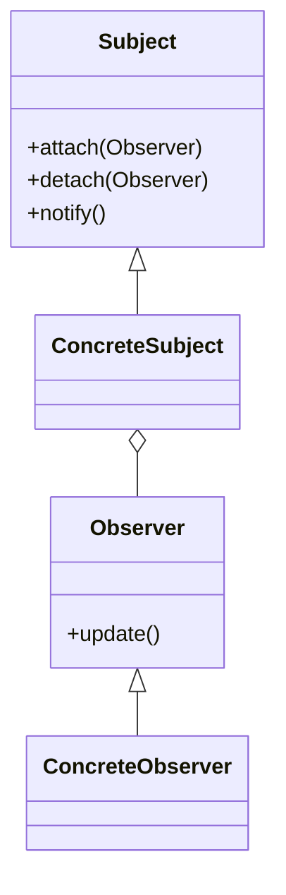

## Observer Design Pattern

The **Observer** pattern defines a one-to-many dependency between objects so that when one object changes state, all its dependents are notified and updated automatically.

### Key Concepts

- **Subject**: Maintains a list of observers and notifies them of state changes.
- **Observer**: Defines an updating interface for objects that should be notified of changes in a subject.

### UML Diagram

### When to Use

- When a change to one object requires changing others.
- When an object should notify other objects without knowing who they are.

### Pros and Cons

**Pros:**
- Loose coupling between subject and observers.
- Easy to add new observers.

**Cons:**
- Can lead to memory leaks if observers are not properly removed.
- Notification order is not guaranteed.

### References

- [Refactoring Guru: Observer Pattern](https://refactoring.guru/design-patterns/observer)
- [Wikipedia: Observer Pattern](https://en.wikipedia.org/wiki/Observer_pattern)

### Further Reading

- [AlgoMaster: Observer Design Pattern](https://blog.algomaster.io/p/bc60ce42-3f17-486f-aa36-4bd5264837e8)
